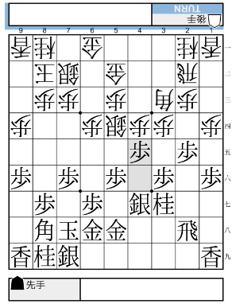

# 将棋同好会(仮)

## 2024-03-31

### 第1局

  
[Shogi Playgroundで見る]()

戦型：三間飛車-居飛車  
手合割：平手

[棋譜をDL](kifs/20240331_01.kif)  

### 第2局

  
[Shogi Playgroundで見る]()

戦型：三間飛車-居飛車  
手合割：平手

[棋譜をDL](kifs/20240331_02.kif)  

## 2024-04-07

### 第1局

  
[Shogi Playgroundで見る]()

戦型：三間飛車-居飛車  
手合割：平手

[棋譜をDL](kifs/20240407_01.kif)  

### 第2局

  
[Shogi Playgroundで見る]()

戦型：三間飛車-居飛車  
手合割：平手

[棋譜をDL](kifs/20240407_02.kif)  

### 第3局

  
[Shogi Playgroundで見る]()

戦型：三間飛車-居飛車  
手合割：平手

[棋譜をDL](kifs/20240407_03.kif)  

### 第4局

  
[Shogi Playgroundで見る]()

戦型：三間飛車-居飛車  
手合割：平手

[棋譜をDL](kifs/20240407_04.kif)  

### 第5局

  
[Shogi Playgroundで見る]()

戦型：三間飛車-居飛車  
手合割：平手

[棋譜をDL](kifs/20240407_05.kif)  

## 2024-04-13

### 第1局

  
[Shogi Playgroundで見る](https://kifu.co/3Rbx)

戦型：三間飛車-居飛車  
手合割：平手

[棋譜をDL](kifs/20240413_01.kif)  

### 第2局

  
[Shogi Playgroundで見る](https://kifu.co/eBVB)

戦型：居飛車-向かい飛車  
手合割：平手

[棋譜をDL](kifs/20240413_02.kif)  

### 第3局

  
[Shogi Playgroundで見る](https://kifu.co/O7d8)

戦型：三間飛車-居飛車  
手合割：平手

[棋譜をDL](kifs/20240413_03.kif)  

### 第4局

  
[Shogi Playgroundで見る](https://kifu.co/8RL3)

戦型：居飛車-角交換振り飛車  
手合割：平手

[棋譜をDL](kifs/20240413_04.kif)  

## 2024-04-20

  
[Shogi Playgroundで見る](https://kifu.co/Agp4)

戦型：居飛車-向かい飛車  
手合割：平手

[棋譜をDL](kifs/20240420_01.kif)  
